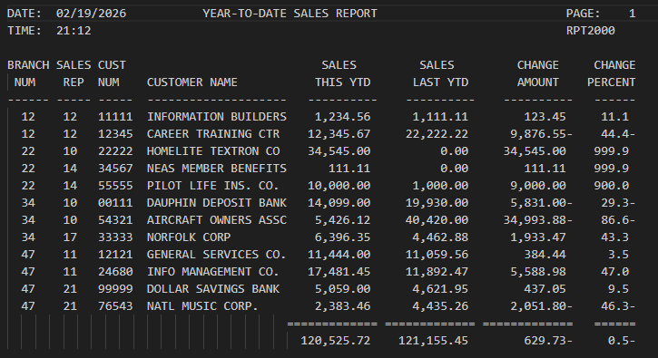

# RPT2000

## Author
* [Violet French](https://github.com/Pirategirl9000)

## Table of Contents
* [Author](#author)
* [Purpose](#purpose)

## Purpose
This program uses a dataset to produce a report based on customer sales reports. The resulting report will be stored to a new dataset. The report details the spendings for this year and last as well as the difference between the two for each customer.
